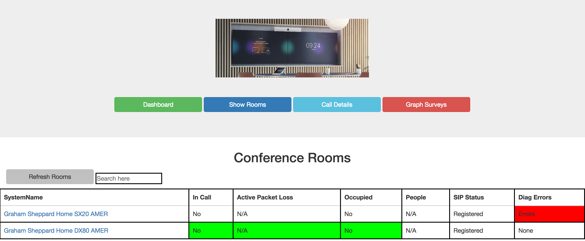

# codec-dashboard

Building a Web dashboard to display/alert on codec information
* Email alerts for network and SIP registration problems
* Web Dashboard Network, SIP, Diag and Packet Loss Alerts
* Web Dashboard Active call and room occupied displays
* Web Dashboard Survey and call detail reports
* Web Dashboard Survey graphs

<h1>Files:</h1>

* boy.py = main file that receives POST from codec, and responds to web requests
* config.py = contains all variables (username, password, ect..)
* roomcontrolconfig.xml =  for customizing Touch10 panels
* actions.py = contains functions for interacting with the codec
* templates.py = this contains the xml formatted data structure for various commands that will be sent to the codec
* templates.py = this contains the xml formatted data structure for various commands that will be sent to the codec
* codec.json = All the current known codecs to monitor
* Survey = Folder that stores all the survey feedback

<h1>Tasks:</h1>

1. Update config-example.py to include your credentials and modify name to config.py
2: virtualenv venv
3: source venv/bin/activate
4: pip install -r requirements.txt
5: python bot.py

<h1>Verification:</h1>
At this point you should have a basic webserver up and running at http://127.0.0.1:5000/

<h1>Adding or Removing Codecs:</h1>

To add codecs you can register them via the command below and the app will start monitoring then. Recommend to put this in your codec startup script

* xcommand HttpFeedback Register FeedbackSlot: 1 ServerUrl:  http://<IP>/codec Format: JSON Expression: /Event/CallDisconnect Expression: /Event/UserInterface/Message Expression: /Status/Call Expression: /Event/UserInterface/Extensions/Widget

To remove codecs you must delete them from the codec.json file